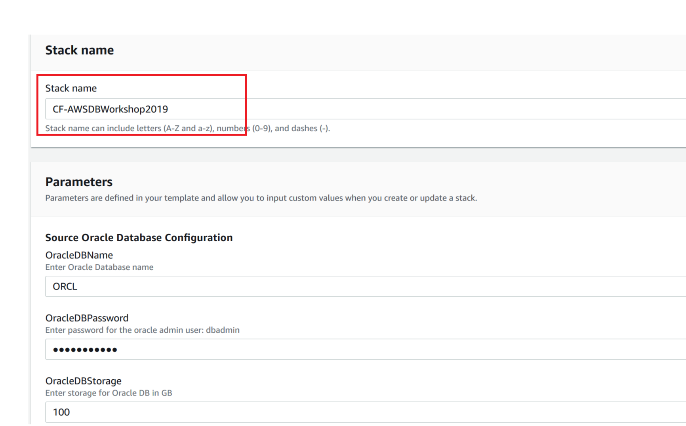
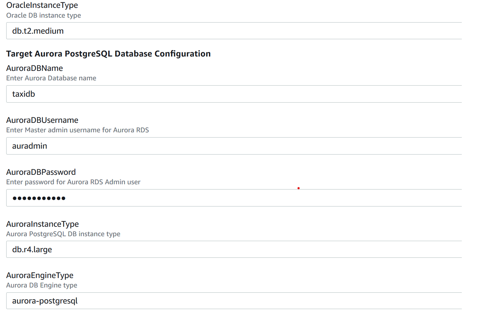
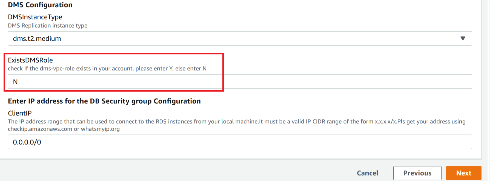

## Amazon RDS Purpose Built Workshop

A tutorial for developers, DBAs and data engineers to get hands-on experience on  how to migrate relational data to AWS purpose-built databases  such as Amazon DynamoDB, Amazon Aurora using AWS DMS and build data processing applications on top of it.

# Overview: Working with AWS Purpose-Built databases

The days of one-size-fits-all, monolithic databases are behind us. Database design and management requires a different mindset in AWS when compared to traditional relational database management system (RDBMS) design. In this workshop, we will demonstrate on how to leverage  both relational (Amazon Aurora) and non-relational databases (Amazon DynamoDB) that are purpose-built to handle the specific needs of an application. for illustrative purpose, we will leverage a relational schema used by the taxi application.

## Pre-requisites
You need to have AWS account with  IAM administrator privileges. We recommend to deploy the solution for Lab1 using CloudFormation template while we go through the presentation. This is to save your time for walkthrough. Please complete the following steps to deploy solution. The CloudFormation will take about 10 minutes to complete.
 
1. Sign into the AWS Management Console [us-west-2](https://console.aws.amazon.com/console/home?region=us-west-2).

2. In the upper-right corner of the AWS Management Console, confirm you are in the US West (Oregon) Region.

3. Launch the below CloudFormation template which will provision the AWS resources in your account. We will leverage the following AWS services as part of this workshop.
      - [VPC](https://docs.aws.amazon.com/vpc/latest/userguide/VPC_Scenario2.html) with Public and Private subnets, NAT Gateway and Route tables 
      - [Oracle RDS](https://aws.amazon.com/rds/oracle/) instance launched from a snapshot  preloaded with a sample taxi schema . This will be used as a source for our migration.
      - [Amazon Aurora PostgreSQL](https://aws.amazon.com/rds/aurora/postgresql-features/) as a target for relational data
      - [Amazon DynamoDB](https://aws.amazon.com/dynamodb/) as a target for NoSQL data
      - [AWS DMS](https://aws.amazon.com/dms/) for migrating database from source to target
      - [AWS Lambda](https://aws.amazon.com/lambda/) for event driven data processing
      - [AWS Cloud9](https://aws.amazon.com/cloud9) IDE  for running scripts and deploying code
      - [IAM Roles for permissions required for AWS DMS]

:warning: **You will be billed for the AWS resource usage** 

Region| Launch
------|-------
US West (Oregon) | 
US East (Virginia) | 

   1. Enter a unique name for your Stack in the Stack name text box or you can use the default name as CF-AWSDBWorkshop2019   

      

   2. We recommend to provide inputs only for OracleDBPassword and AuroraDBPassword and and leave the rest to default values.

      

   3. For ExistsDMSRole, specify Y if dms-vpc-role is already created in your AWS account.  [Go to your IAM console and search for dms-vpc-role](https://console.aws.amazon.com/iam/home?#/roles) . Otherwise, specify N so that it can be created with this CloudFormation stack. This role is required for creating DMS instance. For more information about setting up this role, see [Creating the IAM Roles to Use with the AWS CLI and AWS DMS API](https://docs.aws.amazon.com/dms/latest/userguide/CHAP_Security.APIRole.html). 
   For ClientIP, leave it to default 0.0.0.0/0. However, for your actual deployments,  we strongly recommend that you restrict the access to the RDS instance for your specific IP range. Click Next
       
         

   4. Check the box for acknowledging IAM Role creation with custom names.   Click Create Stack.

        

 > **_NOTE:_** The AWS CloudFormation stack creation takes about 10 minutes. You can see the progress by looking at the events section.

        
      
  
## (Optional) SQL Client Installation
  Download and install the SQL Clients in your laptop or you can use the SQL client tool of your choice. Suggested open source tools which can work with both Oracle an PostgreSQL are provided below. Please note these tools require JDBC drivers  ([postgreSQL](https://jdbc.postgresql.org/) and [Oracle JDBC](https://www.oracle.com/technetwork/database/features/jdbc/jdbc-drivers-12c-download-1958347.html) for connectivity. 
 
     - [dbeaver Community Edition](https://dbeaver.io/download/)
      
     - [SQL-Workbench](https://www.sql-workbench.eu/downloads.html)
 
For step-by-step instructions on how to configure SQL-Workbench to connect to Oracle/PostgreSQL instances ,please refer to AWS Documentation.([PostgreSQL](https://aws.amazon.com/getting-started/tutorials/create-connect-postgresql-db/) and [Oracle](https://docs.aws.amazon.com/dms/latest/sbs/CHAP_RDSOracle2Aurora.Steps.ConnectOracle.html))

  > **_NOTE:_** For Labs, you don't need Oracle Client or any GUI based clients. Oracle Client is required only if you want to explore the sample data in the source.  For working with target (Aurora PostgreSQL) instance, you can leverage [psql](https://www.postgresql.org/docs/9.5/app-psql.html) command line utility. we will install this as part of Lab1.

## Workshop Details

|Lab|Name|
|---|----|
|Lab 1|[Taxi Data Migration using AWS DMS](./lab1-TaxiDataMigration)|
|Lab 2|[TaxiBookingAndPayments](./lab2-TaxiBookingAndPayments)|

## License Summary

The documentation is made available under the Creative Commons Attribution-ShareAlike 4.0 International License. See the LICENSE file.

The sample code within this documentation is made available under the MIT-0 license. See the LICENSE-SAMPLECODE file.
