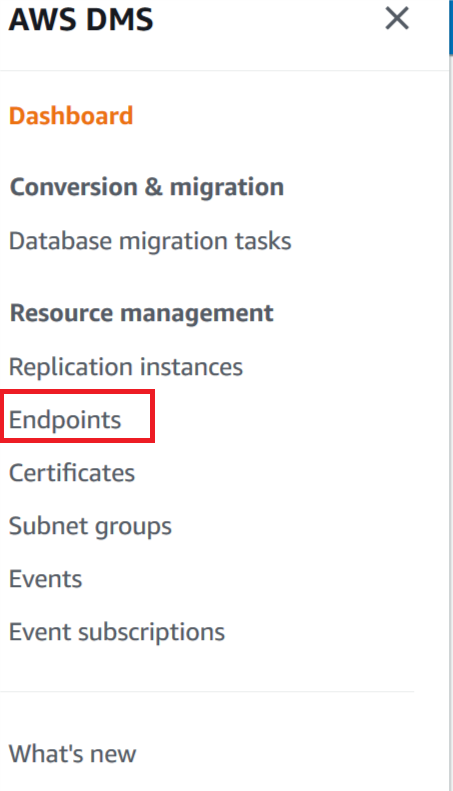
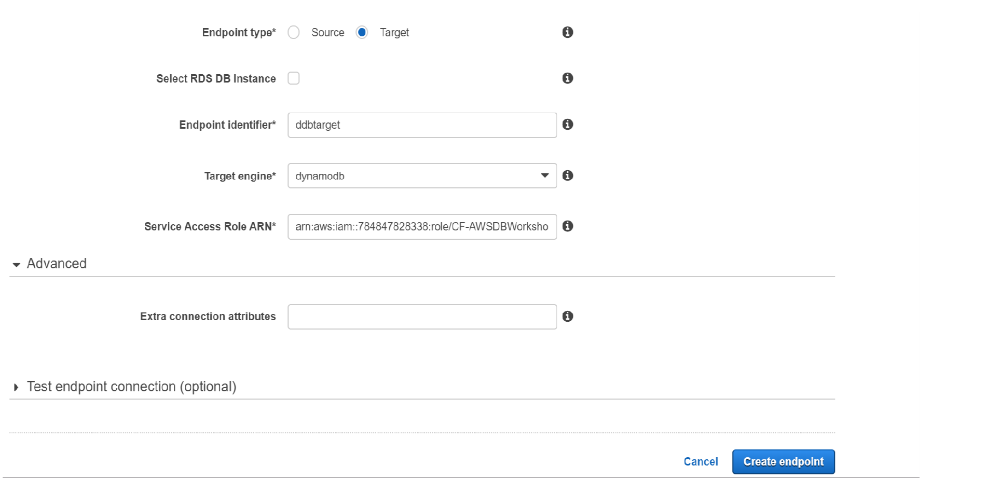
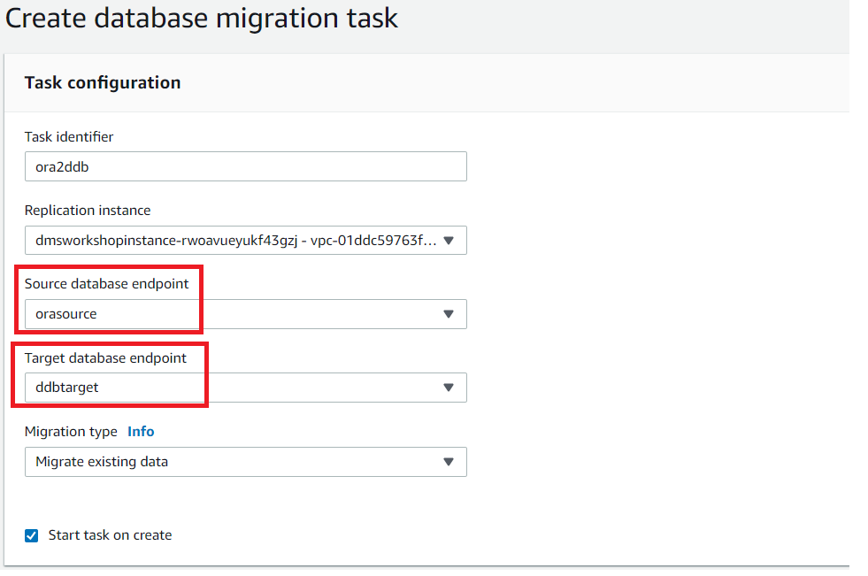
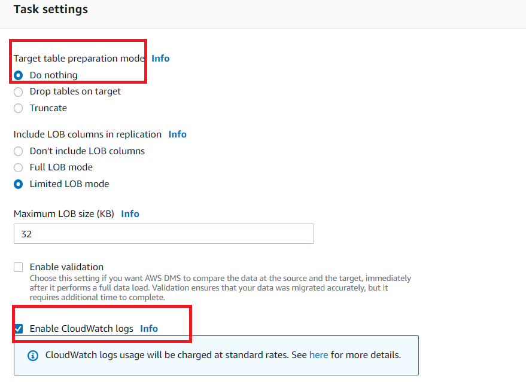
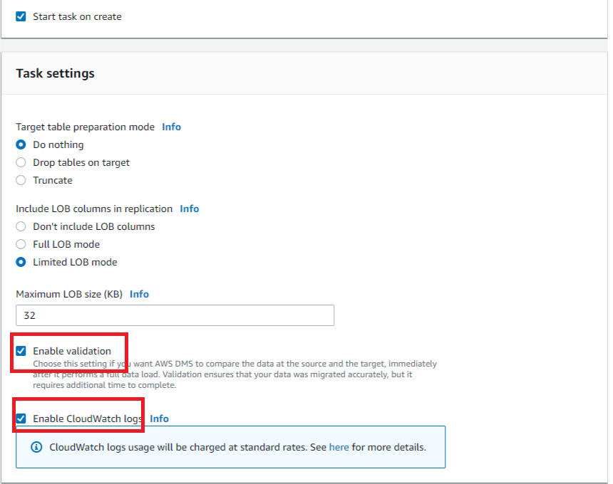
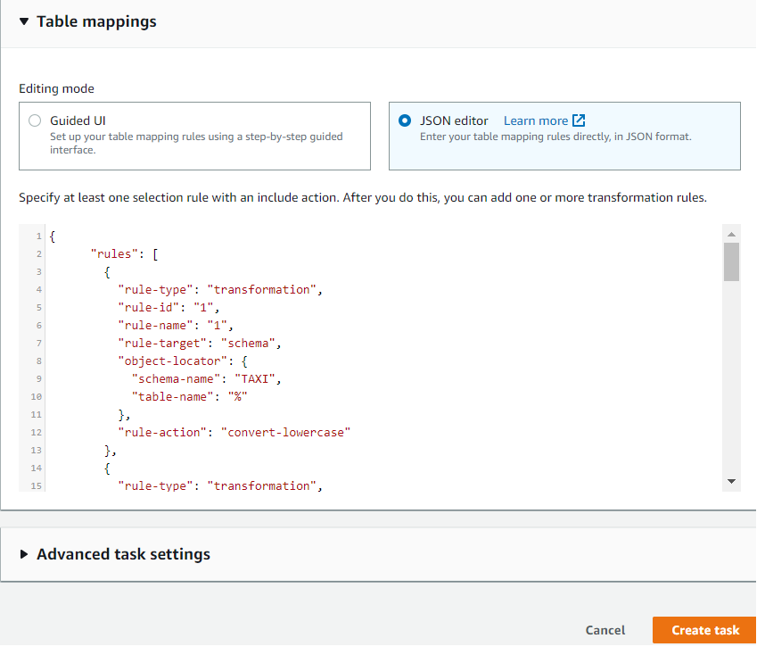

# Lab 1: Migrating Taxi data to Amazon DynamoDB and Amazon Aurora using AWS DMS

* [Overview](#overview)  
* [High level Architecture](#High-level-architecture)
* [Preparing the Environment](#Preparing-the-Environment)  
* [Creating DMS Endpoints for Source and Target databases](#Creating-DMS-Endpoints-for-Source-and-Target-databases)
    * [Create a Source endpoint for Oracle RDS](#Create-a-Source-endpoint-for-Oracle-RDS)
    * [Create a Target endpoint for Aurora PostgreSQL](#Create-a-Target-endpoint-for-Aurora-PostgreSQL)
    * [Create a Target endpoint for Amazon DynamoDB](#Create-a-Target-endpoint-for-Amazon-DynamoDB)
* [Creating Replication Task for DynamoDB Migration](#Creating-Replication-Task-for-DynamoDB-Migration)  
    * [Monitoring Replication Task for DynamoDB](#Monitoring-Replication-Task-for-DynamoDB )
* [Creating Replication Task for Aurora Migration](#Creating-Replication-Task-for-Aurora-Migration) 
    * [Monitoring Replication Task for DynamoDB](#Monitoring-Replication-Task-for-Aurora )

## Overview

[AWS DMS](https://aws.amazon.com/dms/) (Database Migration Service) helps you migrate databases to AWS quickly and securely.
In this lab, you will be performing a migration of sample taxi data schema from Oracle to Amazon DynamoDB and Amazon Aurora PostgreSQL databases. For the purpose of this illustration, we have created a typical relational schema with foreign key dependencies between tables. We have used sample trip data (green taxi-Jan 2016) from [AWS Open dataset registry](https://registry.opendata.aws/nyc-tlc-trip-records-pds/) to populate trips table.


## High Level Architecture 

As part of this lab, we will migrate the **Trips** table  which is used by trips booking and management application to DynamoDB.  The application will store the data as a key-value schema and leverage the automatic scaling, flexible schema, serverless characteristics of DynamoDB for better scalability, availability and performance. 

In DynamoDB, tables, items, and attributes are the core components that you work with. A table is a collection of items, and each item is a collection of attributes. DynamoDB uses primary keys, called partition keys, to uniquely identify each item in a [table](https://docs.aws.amazon.com/amazondynamodb/latest/developerguide/HowItWorks.CoreComponents.html). You can also use [secondary indexes](https://docs.aws.amazon.com/amazondynamodb/latest/developerguide/SecondaryIndexes.html) to provide more querying flexibility. For this lab, we have created a DynamoDB table namely [aws-db-workshop-trips](./assets/ddb.png) with a partition_key:riderid and sort_key (tripinfo) which uniquely identifies the trip data. We will also create a secondary index with driverid so that your application can query the table using both riderid as well as driverid.


For billing and payment use cases, we will migrate the **Billing**, **Riders**, **Drivers** and **Payment** tables to Aurora PostgreSQL. Amazon Aurora combines the performance and availability of traditional enterprise databases with the simplicity and cost-effectiveness of open source databases. The billing and payment application will leverage the ACID, transactional and analytics capabilities of the [PostgreSQL](https://aws.amazon.com/rds/aurora/postgresql-features/) database. Using Aurora, we can scale the read traffic by adding additional read nodes as needed. The figure below depicts the high level deployment architecture.  
 

 

## Preparing the Environment

 1.  Check if the CloudFormation Stack has successfully created the AWS resources. Go to [CloudFormation](https://us-west-2.console.aws.amazon.com/cloudformation/home?region=us-west-2#) and Click on the **Stack** that was created earlier and look at the **Outputs** section. Please note down the Cluster DNS details of Aurora, Oracle RDS details for connectivity. We suggest to copy paste all the output values in a notepad .These details will be used in the subsequent steps as well as in Lab 2.

 


 2. (Optional) Test the connectivity to Oracle RDS from your laptop using SQL Client. You may want to explore the source Oracle schema by running some sample queries against taxi schema. Alternatively, you can also explore the source relational schema [data model](./assets/taxi-data-model.png) and [sample output](./assets/oracle-taxi-schema.txt). e.g. sample query for source (Oracle) schema are given below.
    
    ```
    SELECT owner,OBJECT_TYPE, Count(*) FROM DBA_OBJECTS WHERE OWNER IN ('TAXI') GROUP BY owner,object_type;
    OBJECT_TYPE  COUNT(*)
     TRIGGER 3
     LOB   2
     TABLE 11
     SEQUENCE 5
     INDEX 17
     Select count(*) from taxi.trips;
       Count(*) 
      128714 
      ```
         
3. We will leverage [AWS Cloud9](https://aws.amazon.com/cloud9/) IDE throughout this workshop for running scripts and deploying code, etc.

 4. Open [Cloud9](https://us-west-2.console.aws.amazon.com/cloud9/home?region=us-west-2#) development environment which is created as part of the CloudFormation stack. 

    

 5. In the Cloud9 terminal environment Run the below command to clone the github repository.

    ```shell script
    cd ~/environment
    git clone https://github.com/aws-samples/amazon-rds-purpose-built-workshop.git
    ```

 6. Install postgresql client and related libraries in the Cloud9 environment. This is required to use the postgresql command line utility psql.

    ```shell script
    sudo yum install -y postgresql95 postgresql95-contrib postgresql95-devel 
    ```
7. Connect to target Aurora PostgreSQL using psql command as shown below. For more options and commands, refer to [psql](https://www.postgresql.org/docs/9.6/app-psql.html) documentation

    `sudo psql -h <Aurora cluster endpoint> -U username -d taxidb `

    e.g. sudo psql -h xxxxx.us-west-2.rds.amazonaws.com -U auradmin  -d taxidb

      `\l`  #list the databases in postgresql cluster 

      `\dt`  #list the tables in the database  

      `\quit`  

      `\help` 

    Note: As you have figured out, there are no tables created in Aurora database yet.
  
 8.  Please note that before we migrate data from Oracle RDS to Aurora, we need to setup a target schema. We recommend to leverage [AWS SCT]([https://docs.aws.amazon.com/SchemaConversionTool/latest/userguide/CHAP_Welcome.html) to migrate schema from Oracle to PostgreSQL. However, for this workshop, we have provided a converted schema to use in the target Aurora environment.  Please execute the following command to create the schema.
 
  > **_NOTE:_** Make sure you execute the  command from the root directory of the cloned github repository (or) provide a absolute file path.

    ```shell script
     cd ~/environment/amazon-rds-purpose-built-workshop/
     sudo psql -h <Aurora cluster endpoint> -U username -d taxidb -f ./src/create_taxi_schema.sql
    ```

   e.g. psql -h xxxxx.us-west-2.rds.amazonaws.com -U auradmin  -d taxidb -f ./src/create_nyc_taxi_schema.sql
   
  You can verify if the tables are created by running the below command after logging via psql.

      ```shell script
      \dt  #list the tables in the database
      \d trips #describe a table 
      ```

  

   

**Good Job!!** At this point, you have completed all the pre-requisites.  Please proceed to the data migration part.


## Creating Endpoints for Source and Target databases

Before we perform data migration, we need to create endpoints for both source and target databases for verifying the connectivity. This will be required for creating a migration task later in the workshop. 

Open the [AWS DMS console](https://us-west-2.console.aws.amazon.com/dms/home?region=us-west-2), and choose **Endpoints** in the navigation pane. 




 # Create a Source endpoint for Oracle RDS

  Click **Create endpoint**. Enter the values as follows:

|Parameter|Description|
  |-------------|--------------|
   |Endpoint Identifier | Type a name, such as   **`orasource`**|
   |Source Engine | Oracle|
   |Server name | Enter the Oracle RDS DNS|
   Port | 1521|
   |Username | Enter as dbadmin|
   Password| Enter the password that you entered in the CloudFormation parameter section. (Note:default password: oraadmin123) |
   |SID| ORCL|


 

Please leave the rest of the settings default. Make sure that the database name, port, and user information are correct.  Click **Create endpoint**.


After creating the endpoint, you should test the connection. Click the endpoint and choose **Test connection** option. Choose the DMS instance created by the CloudFormation stack.


 

# Create a Target endpoint for Aurora PostgreSQL 

Click **Create endpoint**. Enter the values as follows:
 
|Parameter| Description|
|------|-------------
 |Endpoint Identifier | Type a name, such as   **`aurtarget`**|
  |Target Engine | aurora-postgresql|
  |Server name | Enter the Aurora Cluster DNS|
  |Port | 5432|
  |Username | Enter as auradmin|
  |Password| Enter the password you entered in the CloudFormation template. (Note: default password: auradmin123) |
  |Database Name| taxidb| 
 
 Please leave the rest of the settings default. Make sure that the Aurora cluster DNS, database name, port, and user information are correct. Click **Create endpoint**.

 
 
 After creating the endpoint, you should test the connection as shown below. Choose the DMS instance created by the CloudFormation stack

 

# Create a Target endpoint for Amazon DynamoDB

Click **Create endpoint**. Enter the values as follows:
 
 |Parameter| Description|
 |------|---------------
  |Endpoint Identifier | Type a name, such as   **`ddbtarget`**|
  |Target Engine | dynamodb|
 |Service access role ARN| Enter the IAM Role ARN (Note: Provide the value of DMSDDBRoleARN from CloudFormation Outputs section)|

   

  Please leave the rest of the settings default. Make sure that the IAM Role ARN information is correct. Click **Create endpoint**.

  
   > **_NOTE:_** Please Click on top right on the DMS Console **Return to the old console experience** if you see the **Create Endpoint** is disabled for some reasons.

   
  
 After creating the endpoint, you should **test the connection** as shown below. Choose the DMS instance created by the CloudFormation stack .

   

## Creating Replication Task for DynamoDB Migration

Using an AWS DMS task, you can specify which schema to migrate and the type of migration. You can migrate existing data, migrate existing data and replicate ongoing changes, or replicate data changes only. This lab, we will migrates existing data only. 

AWS DMS uses table-mapping rules to map data from the source to the target DynamoDB table. AWS DMS currently supports map-record-to-record and map-record-to-document as the only valid values for the rule-action parameter. For this lab, we will use map-record-to-record option to migrate trip data from Oracle to DynamoDB. Please refer to [DMS documentation](https://docs.aws.amazon.com/dms/latest/userguide/CHAP_Target.DynamoDB.html) for more details.

 1. Open the [AWS DMS console](https://us-west-2.console.aws.amazon.com/dms/home?region=us-west-2), and choose **database migration tasks** in the navigation pane. 

 2. Click **Create task**

 3. Task creation includes multiple sections. Under Task Configuration, enter below.
     
    |Parameter| Description|
    |------|---------
    |Task Identifier | Type a name, such as   **`ora2ddb`**|
    |Replication Instance| Choose the DMS instance created by the CloudFormation stack|
    |Source database Endpoint| Choose orasource|
    |Target database Endpoint | Choose ddbtarget|
    |Migration Type| Choose Migrate existing data|
  
  > **_NOTE:_** Typical production migration involves full load followed by continuous data capture CDC. This can be acheived by using choosing option Migrate existing data and replicate ongoing changes. for this illustration, we will go with full load only.

 4. Click **Start task on create**

  


 5. Under Task settings , enter as below
    - Target Table preparation mode  - Choose **Do Nothing**
    - Include LOB columns in replication - Choose **Limited LOB Mode**
    - Enable **Cloud Watch Logs**

    

 6. Under Table Mapping section, enter as below:
  - choose **JSON Editor** and copy & paste the following transformation code.
  
      ```json
      {  
      "rules": [  
      {  
      "rule-type": "selection",  
      "rule-id": "1",  
      "rule-name": "1",  
      "object-locator": {  
      "schema-name": "TAXI",  
      "table-name": "TRIPS"  
      },  
      "rule-action": "include"  
      },  
      {  
      "rule-type": "object-mapping",  
      "rule-id": "2",  
      "rule-name": "2",  
      "rule-action": "map-record-to-record",  
      "object-locator": {  
      "schema-name": "TAXI",  
      "table-name": "TRIPS"  
      },  
      "target-table-name": "aws-db-workshop-trips",  
      "mapping-parameters": {  
      "partition-key-name": "riderid",  
      "sort-key-name": "tripinfo",  
      "attribute-mappings": [  
      {  
      "target-attribute-name": "riderid",  
      "attribute-type": "scalar",  
      "attribute-sub-type": "string",  
      "value": "${RIDER_EMAIL}"  
      },  
      {  
      "target-attribute-name": "tripinfo",  
      "attribute-type": "scalar",  
      "attribute-sub-type": "string",  
      "value": "${ID},${PICKUP_DATETIME}"  
      },  
      {  
      "target-attribute-name": "driverid",  
      "attribute-type": "scalar",  
      "attribute-sub-type": "string",  
      "value": "${DRIVER_EMAIL}"  
      },  
      {  
      "target-attribute-name": "DriverDetails",  
      "attribute-type": "scalar",  
      "attribute-sub-type": "string",  
      "value": "{\"Name\":\"${DRIVER_NAME}\",\"Vehicle Details\":{\"id\":\"${VEHICLE_ID}\",\"type\":\"${CAB_TYPE_ID}\"}}"  
      }  
      ]  
      }  
      }  
      ]  
      }
      ```
   

   > **_NOTE:_** As part of the migration task, we have created transformation rules to add few extra attributes from the original data. for e.g. RIDER_EMAIL as riderid (partition_key) and ID & PICKUP_DATETIME as tripinfo(sort key). This will ensure that our new design will able to uniquely identify the trip data by riderid. Also, we have combined many vehicle attributes and store it as DriverDetails. In summary, this table stores all the rider and driver information in a de-normalized manner.

    

 7. Do not modify anything in the Advanced settings.

 8. Click **Create task**. The task will begin immediately. if not, please start the task (Click the Actions and Start/Restart task).

  
## Monitoring Replication Task for DynamoDB 

After task is created, please monitor the task, by looking at the console as shown below. You can also look at the CloudWatch logs for more information.

 

> **_NOTE:_** This task may for 10 to 15 minutes.  Please proceed to the next step.

## Creating Replication Task for Aurora Migration
 Now, we will migrate four tables (Riders, Drivers, Payment and Billing) from Oracle to Aurora PostgreSQL. We have already created the DDL for those tables in Aurora as part of the environment setup.

 1. Open the [AWS DMS console](https://us-west-2.console.aws.amazon.com/dms/home?region=us-west-2), and choose **database migration tasks** in the navigation pane. 

 2. Click **Create task**.

 3. Database Migration Task creation includes multiple sections. Under Task Configuration, enter below.
     
    |Parameter| Description|
    |------|----------------|
    |Task Identifier | Type a name, such as   **`ora2aurora`**|
    |Replication Instance| Choose the DMS instance created by CloudFormation|
    |Source database Endpoint| Choose orasource|
    |Target database Endpoint | Choose aurtarget|
    |Migration Type| Choose Migrate existing data|
  
 4. Click **Start task on create**

  

 5. Under Task settings , enter as below
    - Target Table preparation mode  - Choose **Do Nothing**
    - Include LOB columns in replication - Choose **Limited LOB Mode**
    - Enable **Validation**
    - Enable **Cloud Watch Logs**

 

 6. Under Table Mapping section, enter as below:
  - choose **JSON Editor** and copy & paste the following mapping code.
  
      ```json
      {
      "rules": [
        {
          "rule-type": "transformation",
          "rule-id": "1",
          "rule-name": "1",
          "rule-target": "schema",
          "object-locator": {
            "schema-name": "TAXI",
            "table-name": "%"
          },
          "rule-action": "convert-lowercase"
        },
        {
          "rule-type": "transformation",
          "rule-id": "2",
          "rule-name": "2",
          "rule-target": "table",
          "object-locator": {
            "schema-name": "TAXI",
            "table-name": "%"
          },
          "rule-action": "convert-lowercase"
        },
        {
          "rule-type": "transformation",
          "rule-id": "3",
          "rule-name": "3",
          "rule-target": "schema",
          "object-locator": {
            "schema-name": "TAXI"
          },
          "value": "public",
          "rule-action": "rename"
        },
        {
          "rule-type": "selection",
          "rule-id": "4",
          "rule-name": "4",
          "object-locator": {
            "schema-name": "TAXI",
            "table-name": "DRIVERS"
          },
          "rule-action": "include"
        },
        {
          "rule-type": "selection",
          "rule-id": "5",
          "rule-name": "5",
          "object-locator": {
            "schema-name": "TAXI",
            "table-name": "RIDERS"
          },
          "rule-action": "include"
        },
        {
          "rule-type": "selection",
          "rule-id": "6",
          "rule-name": "6",
          "object-locator": {
            "schema-name": "TAXI",
            "table-name": "BILLING"
          },
          "rule-action": "include"
        },
        {
          "rule-type": "selection",
          "rule-id": "7",
          "rule-name": "7",
          "object-locator": {
            "schema-name": "TAXI",
            "table-name": "PAYMENT"
          },
          "rule-action": "include"
        },
        {
          "rule-type": "transformation",
          "rule-id": "8",
          "rule-name": "8",
          "rule-target": "column",
          "object-locator": {
            "schema-name": "TAXI",
            "table-name": "%",
            "column-name": "%"
          },
          "rule-action": "convert-lowercase"
        }
      ]
    }
      ```
   
   > **_NOTE:_** As part of the migration task, we have created the above mapping rule to include tables that are related to Payment and Billing use case only. DMS provides rich set of selection and transformation rules for migration (e.g. selecting specific tables, remove column,define primary key etc.). For this lab, we will convert the source schema to lower case and rename the schema owner from taxi to public in Aurora PostgreSQL database. Please refer to [DMS](https://docs.aws.amazon.com/dms/latest/userguide/CHAP_Tasks.CustomizingTasks.TableMapping.html) documentation to learn more.

  

 4. Do not modify anything in the Advanced settings.

 5. Click **Create task**. The task will begin immediately. if the task is not started, please start the task manually (Click the Actions and Start/Restart task).

 

 ## Monitoring Replication Task for Aurora PostgreSQL

1. Go to Replication task and **Click the task** and look at the Table Statistics.


2. You can also see the logs in CloudWatch Logs.


**Congrats!!** You have successfully completed the Lab1. Now you can proceed to [Lab 2](../lab2-TaxiBookingAndPayments/). 